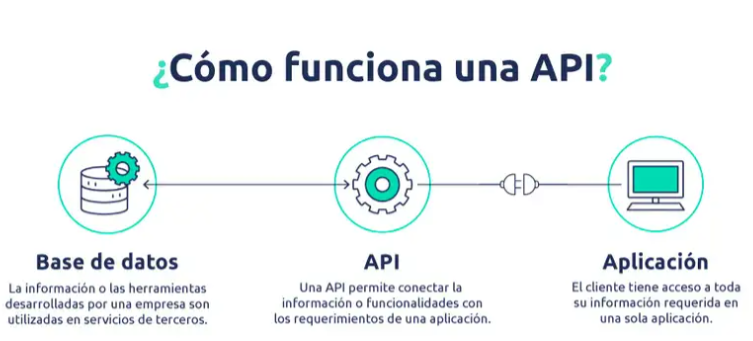

# Documentación para Nuevos Desarrolladores de Python

## ¿Que son y para qué usamos las Clases en Python?

En programación, **una clase** es una estructura que permite agrupar datos y funciones que operan sobre esos datos en una sola entidad. 

En Python, las clases se utilizan para crear objetos que encapsulan tanto *atributos* (datos) como *métodos* (funciones). Esta organización facilita la reutilización y modularidad del código.

Es decir, **una clase** es como el molde o la receta para crear algo, en este caso que vamos a usar como ejemplo, una factura. Y cada factura que creamos a partir de ese molde es un objeto.

#### Sintaxis y ejemplo

```python
class Invoice:
  	def greeting(self):
    		return 'Hi there'
inv_one = Invoice()
print(inv_one.greeting())
```
Aquí estamos creando una clase llamada **Invoice.** `class Invoice:`
- Una **clase** es como un molde que define cómo se comportarán los objetos creados a partir de ella.
- En este caso, la **clase Invoice** representa una factura.

Con esto, definimos un método dentro de la clase:

```python
  def greeting(self):
    return 'Hi there'
```

- **def greeting(self):** → Esto define **una función dentro de la clase.** En este caso, se llama *greeting*.
- **self** → Es una referencia al propio objeto. Cada vez que creamos un objeto a partir de *Invoice*, este método podrá usarse en ese objeto.
- **return 'Hi there'** → Cuando alguien llame al método greeting(), la función devolverá el texto *"Hi there"*.

Lo siguiente es crear un objeto de la clase:

`inv_one = Invoice()`

- En este caso, estamos creando un **objeto** llamado *inv_one*.
- **Invoice()** llama a la clase y **crea una nueva instancia** de *Invoice*.
- Ahora **inv_one** es un objeto basado en la **clase Invoice**, lo que significa que puede usar el *método greeting()*.

Por último, llamamos al método y mostramos el resultado en pantalla:

`print(inv_one.greeting())`

- **inv_one.greeting()** llama al *método greeting()* dentro del *objeto inv_one*.
- Como el **método greeting()** devuelve **"Hi there"**, la función **print()** lo muestra en la pantalla.

#### Beneficios de usar Clases en Python

- **Reutilización de código**: Las clases permiten crear plantillas reutilizables para objetos similares, evitando con ello la duplicación de código.

- **Encapsulamiento**: Agrupan datos y métodos que operan sobre esos datos, protegiendo asi la integridad de la información.

- **Herencia**: Facilitan la creación de nuevas clases basadas en clases existentes, promoviendo la extensión y especialización del código.

- **Polimorfismo**: Permiten que diferentes clases respondan de manera distinta al mismo método, aumentando la flexibilidad del código. Mas adelante explicaremos mas en detalle con un ejemplo el polimorfismo.

#### Buenas Prácticas al Definir Clases en Python

- **Nombres descriptivos**: Utiliza nombres de clase que reflejen claramente su propósito.

- **Uso del método __init__**: Define el constructor para inicializar los atributos de la clase. Explicaremos con ejemplo el uso de este método en el siguiente apartado. 

- **Encapsulamiento adecuado**: Usa atributos privados (con doble guion bajo) para proteger datos que sean sensibles.

- **Documentación**: Incluye docstrings para describir la funcionalidad de la clase y sus métodos.

---

## ¿Qué método se ejecuta automáticamente cuando se crea una instancia de una clase?

El método `__init__()` es el que se ejecuta automáticamente al instanciar una clase.

### ¿Què es init?
La función **__init__()** en Python es un constructor, es decir, un método especial que se ejecuta automáticamente cuando creamos un objeto a partir de una clase y se usa para inicializar las propiedades del objeto.
Piensa en **__init__()** como una plantilla que podemos usar para poder establecer cómo será cada objeto que creemos a partir de una clase.

#### Sintaxis y ejemplo
En este caso, queremos crear una clase llamada Perro para representar perros con un nombre y una raza. Usamos **__init__()** para asignar esos valores *(nombre y raza)* cuando creamos un nuevo perro.

```python
class Perro:
    def __init__(self, nombre, raza):
        self.nombre = nombre  # Así guardamos el nombre del perro
        self.raza = raza      # Así guardamos la raza del perro
    def ladrar(self):
        return f"{self.nombre} está ladrando ¡Guau guau!"

# Así creamos un objeto, (un perro llamado "Nova" de raza "Border Collie")
mi_perro = Perro("Nova", "Border Collie")

# Y con esto, podemos acceder a sus propiedades e imprimir en pantalla:
print(mi_perro.nombre)  # Muestra en pantalla: Nova
print(mi_perro.raza)    # Muestra en pantalla: Border Collie

# Por último, llamaos a su método ladrar
print(mi_perro.ladrar())  # Muestra en pantalla: Nova está ladrando ¡Guau guau!

```
#### Resumen

1. La **clase Perro** tiene un constructor __init__ que recibe dos parámetros: *nombre y raza*.
2. Dentro de __init__, usamos **self.nombre = nombre** para guardar el nombre del perro y **self.raza = raza** para la raza.
3. Cuando creamos **mi_perro = Perro("Nova", "Border Collie")**, __init__ se ejecuta automáticamente y asigna *"Nova"* y *"Border Collie"* a **mi_perro**.
4. Podemos acceder a **mi_perro.nombre** y **mi_perro.raza** porque quedaron almacenados dentro del objeto.

---

## ¿Cuáles son los tres verbos de API?

Los tres verbos principales de una API (siglas de "Application Programming Interface") son:

### **GET**
Se utiliza para solicitar datos de un servidor. Es como cuando visitas una página web y ves el contenido en tu navegador: tu navegador está haciendo una petición `GET` para obtener esa información.

#### Ejemplo

Supongamos que tenemos una API que gestiona usuarios. Para obtener la lista de todos los usuarios, haríamos una solicitud GET así:

```python
GET /usuarios
```
Esto le dice al servidor: "Envíame la lista de usuarios".

Si quisiéramos obtener un usuario específico con ID 1, haríamos:

```python
GET /usuarios/1
```

#### Beneficios de GET

- No modifica los datos del servidor.

- Puede ser almacenado en caché para mejorar el rendimiento.

- Es fácil de probar desde el navegador.

#### Desventajas de GET

- No se debe usar para enviar información sensible en la URL.

- Tiene límites en la cantidad de datos que se pueden enviar en la URL.

### **POST**
El verbo POST se usa para enviar datos al servidor con el fin de crear un nuevo recurso. A diferencia de `GET`, `POST` sí cambia el estado del servidor.

#### Ejemplo

Para crear un nuevo usuario en el sistema, haríamos una solicitud POST con datos adjuntos:

```python
POST /usuarios

# Datos enviados en el cuerpo de la solicitud:

{
  "nombre": "Juan Pérez",
  "email": "juan@ejemplo.com"
}
```

El servidor responderá con un mensaje indicando que el usuario ha sido creado.

#### Beneficios de POST

- Permite enviar grandes cantidades de datos en el cuerpo de la solicitud.

- Es seguro para enviar datos sensibles (si se usa HTTPS).

#### Desventajas de POST

- No se puede almacenar en caché.

- Puede generar duplicados si la solicitud se envía varias veces sin control.

### **DELETE** 
El verbo `DELETE` se utiliza para eliminar un recurso en el servidor. Una vez ejecutada esta operación, el recurso desaparece y no se puede recuperar (a menos que haya un sistema de respaldo).

#### Ejemplo

Para eliminar un usuario con ID 1, haríamos:

```python
DELETE /usuarios/1
```

Esto le dice al servidor: "Elimina el usuario con ID 1".

#### Beneficios de DELETE

- Es simple y directo.

- Mantiene la base de datos limpia eliminando datos innecesarios.

#### Desventajas de DELETE

- Si se usa incorrectamente, puede llevar a la pérdida irreversible de datos.

- No siempre es reversible, a menos que se implemente un sistema de recuperación.

---

## ¿Es MongoDB una base de datos SQL o NoSQL?

**MongoDB** es una base de datos **NoSQL** de código abierto, orientada a documentos. A diferencia de las bases de datos tradicionales que utilizan tablas y filas, MongoDB almacena los datos en documentos flexibles como puede JSON. Esta estructura permite manejar datos estructurados, semiestructurados y no estructurados de una manera eficiente.

#### Ventajas de MongoDB

1. **Flexibilidad en el modelado de datos**: Al no requerir un esquema fijo, *MongoDB permite modificar la estructura de los datos en cualquier momento*, facilitando la adaptación a cambios en los requisitos de la aplicación. 

2. **Escalabilidad horizontal**: Soporta la distribución de datos en múltiples servidores mediante sharding, lo que permite manejar grandes volúmenes de información y tráfico.

3. **Alto rendimiento**: Optimizado para operaciones de lectura y escritura, MongoDB es ideal para aplicaciones que requieren procesamiento rápido de grandes cantidades de datos.

4. **Integración con JSON/BSON**: Almacena datos en formato BSON, facilitando la integración con aplicaciones que utilizan JSON para el intercambio de información. 

#### Desventajas de MongoDB

1. **Consumo de almacenamiento**: La ausencia de un esquema fijo y la necesidad de almacenar las claves en cada documento pueden aumentar el uso de espacio en disco. 

2. **Limitada funcionalidad de transacciones**: Aunque ha mejorado en versiones recientes, MongoDB no ofrece el mismo nivel de soporte para transacciones complejas como las bases de datos relacionales.

3. **Curva de aprendizaje**: Para desarrolladores acostumbrados a bases de datos SQL, la transición a MongoDB puede requerir un cambio significativo en la forma de modelar y consultar datos.

#### Popularidad de MongoDB

MongoDB se ha convertido en una opción popular debido a su **capacidad para manejar datos de manera flexible y escalable**, lo que lo hace ideal para aplicaciones modernas que requieren rapidez en el desarrollo y adaptación a cambios. 
Su integración con lenguajes de programación como JavaScript y plataformas como Node.js ha impulsado su adopción en el desarrollo de aplicaciones web y móviles. 

#### Ejemplo

```python
{
    "nombre": "Jenny",
    "edad": 36,
}

Otro documento en la misma colección puede tener diferentes campos:

{
    "nombre": "María",
    "email": "maria@email.com"
}
```
#### Resumen
- MongoDB es una base de datos NoSQL porque no usa tablas, sino documentos JSON (es un formato de texto usado para almacenar y transportar datos de manera estructurada. Es como una lista organizada de datos en texto, fácil de leer y compartir entre sistemas).
- Es flexible porque permite datos sin una estructura fija.
- Es escalable porque distribuye datos en múltiples servidores.
- Es ideal para aplicaciones modernas con grandes volúmenes de datos.
---

## ¿Qué es una API?

El término **API** es una abreviatura de *Application Programming Interfaces*, que en español significa *interfaz de programación de aplicaciones*. Se trata de un conjunto de definiciones y protocolos que se utiliza para desarrollar e integrar el software de las aplicaciones, permitiendo la comunicación entre dos aplicaciones de software a través de un conjunto de reglas.

De cara a un usuario normal, lo único que vas a ver de una API son los resultados, cómo abres un juego para el móvil y puedes conectarte a tu cuenta de Facebook para iniciar sesión, o cómo puedes publicar los resultados de una partida en Twitter. 

### Para qué sirve una API

Una de las principales funciones de las API es **facilitar** el trabajo a los desarrolladores y **ahorrarles tiempo**. Por ejemplo, si estás creando una aplicación que es una tienda online, no necesitarás crear desde cero un sistema de pagos u otro para verificar si hay stock disponible de un producto. Podrás utilizar la API de un servicio de pago ya existente, por ejemplo PayPal, y pedirle a tu distribuidor una API que te permita saber el stock que ellos tienen.

### ¿Cómo funciona una API?

Para comprenderlo mejor, si piensas en que una empresa tiene, por un lado un programa (software), en el que se registra el inventario en tiempo real. Es decir, se puede ver cuántos productos hay en existencia, si habrá salidas o renovación de stock. A su vez, la empresa cuenta con una tienda en línea, en la que necesita tener sus existencias en tiempo real. Para no actualizar los dos programas por separado, se puede usar una API.



**La API servirá como intermediaria de la información**. Por un lado, la tienda en línea le “pedirá” al software de inventario la información de la cantidad de productos disponibles. La API hará la petición, tomará la información y la colocará en el sitio web. De esta manera, ambas plataformas estarán conectadas. 

#### Ejemplos de APIs

- **redes sociales**: Estas permiten, por ejemplo, conectar las menciones que se realicen en redes sociales con tu sitio web. Así, se mostrarán siempre las más recientes sin necesidad de actualizaciones manuales.
- **plataformas de marketing**: Dan la oportunidad de conectar la información recabada en un formulario en tu sitio web, por ejemplo, y depositarla en tu base de contactos para que posteriormente le puedas enviar una campaña de email marketing. 
- **mapas**: Ya sea de google o de otra compañía con geolocalización en mapas, permitirá incluir esta funcionalidad en tu sitio web, app o interfaz.
- **pagos**: Sirven para conectar los servicios de pago a cualquier plataforma digital para utilizar su servicio fácilmente.

---

## ¿Qué es Postman?

Postman es **una herramienta de colaboración y desarrollo** que permite a los desarrolladores interactuar y probar el funcionamiento de servicios web y aplicaciones, proporcionando una interfaz gráfica intuitiva y fácil de usar para enviar solicitudes a servidores web y recibir las respuestas correspondientes

Con esta plataforma se puede gestionar diferentes entornos de desarrollo, organizar las solicitudes en colecciones y realizar pruebas automatizadas para verificar el comportamiento de los sistemas. 

#### ¿Para qué se utiliza?

- **Envío de solicitudes**. Permite enviar solicitudes `GET, POST, PUT, DELETE` y otros métodos HTTP a una API especificando los parámetros, encabezados y cuerpo de la solicitud.
- **Gestión de entornos**. Facilita la configuración para diferentes entornos (por ejemplo, desarrollo, prueba, producción) y el cambio sencillo entre ellos (para realizar pruebas y desarrollo en diferentes contextos).
- **Colecciones de solicitudes**. Agrupa las solicitudes relacionadas en colecciones, lo que facilita la organización y ejecución de pruebas automatizadas.
- **Pruebas automatizadas**. Es ideal para crear y ejecutar pruebas automatizadas para verificar el comportamiento de una API (detectar errores e incrementar la calidad del software).
- **Documentación de API**. Genera de forma automatizada, documentación detallada de la API a partir de las solicitudes y respuestas realizadas, lo que facilita su comprensión y uso por parte de otros desarrolladores.

#### Ejemplo para obtener una lista de usuarios desde una API pública:

**Pasos en Postman**:

1. Abrimos Postman.

2. Seleccionamos el método GET.

3. Ponemos la URL: *https://reqres.in/api/users?page=2*.

Obtendriamos una respuesta con datos de los usuarios, similar a la siguiente imagen:


---

## ¿Qué es el polimorfismo?

El **polimorfismo** es un concepto de programación orientada a objetos que significa que **diferentes clases pueden usar el mismo método, pero con comportamientos distintos**.
En otras palabras, varias clases pueden tener un método con el mismo nombre, pero hacer cosas diferentes según la clase a la que pertenecen.

#### Ejemplo

```python
class Animal:
    def hacer_sonido(self):
        pass # Con esto, significa que no hace nada aún. Esta es una forma de definir un método que las clases hijas deberán implementar, en nuestro ejemplo, la clase Perro y Gato.

class Perro(Animal):
    def hacer_sonido(self):
        return "Guau!"

class Gato(Animal):
    def hacer_sonido(self):
        return "Miau!"

animales = [Perro(), Gato()]
for animal in animales:
    print(animal.hacer_sonido())  # Muestra en pantalla:  Guau! Miau!
```
---

## ¿Qué es un método dunder?

Los métodos **"dunder"** son funciones especiales en Python que tienen un significado particular. Se llaman así porque comienzan y terminan con `"__"`.

Entre los mas destacados, tenemos el **init** el cual hemos explicado al incio de nuestra documentación, y a continuación, mostraremos otros de los mas comunes.

### Metodo `__str__()`: 

Este método permite definir cómo se debe mostrar un objeto como texto cuando lo imprimes usando la función print(). Es decir, define cómo se debe mostrar un objeto cuando lo imprimes, controlando la forma en que se "representa" el objeto como una cadena de texto.

### ¿Por qué es útil __str__?

Hace que los objetos sean más fáciles de entender y trabajar con ellos. Es útil cuando estás depurando tu código o mostrando información importante de objetos. Lo usas cuando quieres que la salida de un objeto sea más comprensible o clara.

#### Ejemplo

```python
class Invoice:
  def __str__(self):
    return "¡Esta es la clase de factura!"

inv = Invoice()
print(str(inv))
```
Dentro de la clase Invoice, definimos un método especial llamado __str__. Este método se ejecuta cuando tratamos de convertir un objeto en texto (por ejemplo, al usar **print()** o **str()**). En este caso, el método simplemente devuelve la cadena de texto **¡Esta es la clase de factura!**.

### ¿Qué es el método `__repr__`?

El método __repr__ es otro método especial que puedes definir en una clase en Python. La principal diferencia entre __repr__ y __str__ es que __repr__ está diseñado principalmente para representar el objeto de manera más detallada y precisa o cuando lo llamas directamente sin usar print().

### ¿Cómo se usa __repr__?

Mientras que el método __str__ se utiliza para dar una "representación amigable" del objeto, el método __repr__ está más orientado a dar una representación que pueda ser usada para **recrear el objeto** o al menos para entender más fácilmente sus características internas.

#### Ejemplo

```python
class Invoice:
  def __init__(self, client, total):
    self.client = client
    self.total = total

  def __repr__(self):
    return f"Invoice({self.client}, {self.total})"

inv = Invoice('Google', 500)
print(repr(inv))	# Muestra en pantalla: Invoice(Google, 500)

```
---

## ¿Qué es un decorador de python?

Un decorador en Python es una función que modifica el comportamiento de otra función sin cambiar su código original. 

#### ¿Para qué se utiliza?

- Para verificar permisos antes de ejecutar una función

- Para guardar información sobre llamadas a funciones.

- Para modificar entradas o salidas de funciones

Un decorador se define como una función que recibe otra función como argumento, la envuelve con una nueva funcionalidad y la retorna.

#### Ejemplo

```Python 
def decir_hola(funcion):
    def envoltura():
        print("Hola!")  # Mensaje antes de ejecutar la función original
        funcion()  # Ejecutar la función original
    return envoltura

@decir_hola
def despedida():
    print("Adiós!")

despedida() # Muestra en pantalla Hola! y Adiós!

```
- En este ejemplo, definimos el **decorador decir_hola(funcion)**, que envuelve otra función.

- Dentro de envoltura():

  - Primero muestra "Hola!".

  - Luego ejecuta la función original (funcion()), que en este caso imprime "Adiós!".

- Usamos **@decir_hola** antes de despedida() para aplicar el decorador.

- Cuando llamamos despedida(), se ejecuta el decorador antes de la función original.

